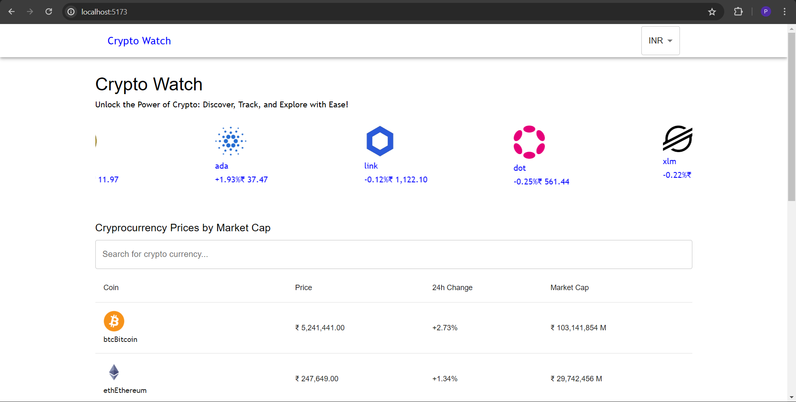

## Crypto Watch

### Set up 
```bash
git clone https://github.com/priyanshu16095/stock-watch.git
cd stock-watch
cd frontend
npm install
npm run dev
```

### Folder Structure
```
├── public/           # Public assets and HTML template
├── src/              # Source files
│   ├── pages/        # Different pages
│   ├── components/   # Differnet components
│   ├── App.jsx       # Main application component
│   ├── index.css     # Global CSS styles
│   └── main.jsx      # Entry point
├── .gitignore        # Git ignore file
├── package.json      # Lock file
├── index.html        # Entry point for entire application
├── package.json      # NPM package configuration
├── README.md         # Project README
└── vite.config.js    # Vite configuration file
```

### Technologies Used
* React Js
* Material UI
* API: Alpha Vantage (Free)

### Key Features
* **Pagination:**   The application includes pagination functionality, allowing users to navigate through multiple pages of cryptocurrency data efficiently.
* **Watchlist:** Users can add cryptocurrencies to their watchlist, enabling them to keep track of specific coins and monitor their performance over time.

### UI
* **Styling:** 
In the index.css file, there are various utility classes to ensure consistent UI:
    * Flex-
        * flex-h: Horizontal Flex
        * flex-s: Horizontal Flex and Space between
        * flex-s: Horizontal Flex and Justify Content Center
        * flex-v: Vertical Flex\
                  There are three types of flex-v with different gap sizes.
    * Font- Only h6, h5 and sub-title variants provided by Material-UI are used.
* **Responsive:** 
The entire UI is responsive, thanks to the Container component provided by Material-UI.


